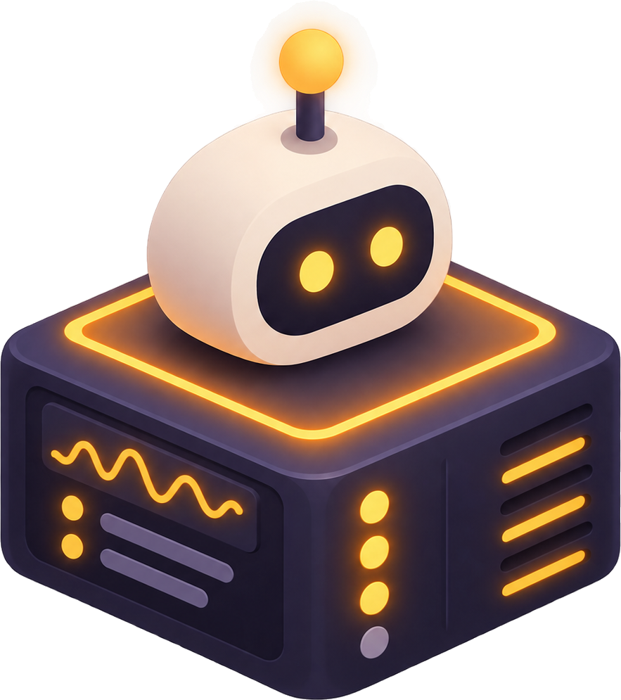
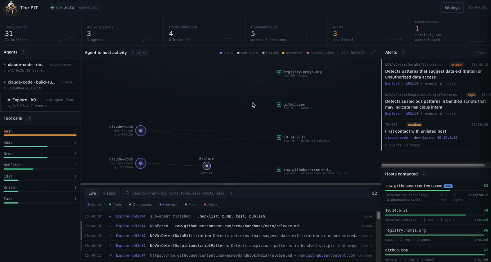

<p align="center"></p>

# The PIT

**Multi-agent observability and threat detection.** A security console for AI coding
agents: it records what agents do on a machine (prompts, tool calls, commands, files,
hosts), scores the hosts they reach, runs detection rules, and shows alerts, a live
event stream and an agent-to-host map. Sub-agents are tracked as their own nodes.



Sources: Claude Code (hooks + native telemetry), [Numbat](https://github.com/perplexityai/numbat),
and any OpenTelemetry exporter using the GenAI conventions. Rules: a small built-in set,
[Nova](https://github.com/Nova-Hunting/nova-framework) with the community
[nova-rules](https://github.com/Nova-Hunting/nova-rules), and host reputation from VirusTotal.

## Run

**With Docker**

```sh
docker compose up --build
```

Open http://localhost:4318. Nova is enabled out of the box (the image ships the rules and
its Python environment); its embedding model, ~90 MB, is downloaded on first start into the
`pit-models` volume, so give it a minute. Settings, event history and the reputation cache
live in `pit-data`. Both survive `docker compose down`; `down -v` deletes them.

If you also run the collector locally, stop it first: both listen on port 4318.

**Without Docker** (Node 24, [uv](https://docs.astral.sh/uv/), git)

```sh
npm run setup   # once: npm dependencies, nova-rules clone, Python sidecar
npm run up      # builds the UI and starts everything on http://localhost:4318
```

One process serves the UI and the API, and starts and supervises the Nova sidecar.
For UI development use `npm run collector` plus `npm run dev` (Vite on port 5173).

## Connect Claude Code

```sh
npm run hooks:install              # this project only
npm run hooks:install -- --global  # every project (~/.claude/settings.json)
```

This adds hooks (`SessionStart`, `SubagentStart`, `UserPromptSubmit`, `PreToolUse`,
`PostToolUse`, …) that post each event to the collector, and the environment for Claude
Code's native OpenTelemetry export (model calls, tokens, cost). New sessions appear in
the console as `claude-code · <machine>`. `npm run hooks:remove` undoes it. The hook
exits in under 1.5 s and never blocks the agent if the collector is down.

## Configure

Everything is in the UI under **Settings** (⌘,) and stored on the collector.

- **VirusTotal**: paste a free API key from virustotal.com/gui/my-apikey. Every host an
  agent contacts is scored 0–100; private ranges are never sent. The free tier allows
  4 lookups a minute and 500 a day, so verdicts are cached and queued; hosts show as
  "checking" until scored. An allow list marks trusted hosts.
- **Nova**: on by default with Docker, off after a local install until
  `nova-service/setup.sh` has run; tick to enable. The sidecar runs the community rules over prompts, tool
  output and (optionally) commands. Untick a rule to disable it; "Update rules from
  GitHub" pulls the latest set. Rules are used as published: the only intervention is
  the disable list.
- **Numbat**: point `numbat ship` at `http://<collector>:4318/ingest/numbat`; bearer or
  HMAC auth is configured under Trace source. Numbat findings arrive as alerts.
- **OpenTelemetry**: `OTEL_EXPORTER_OTLP_ENDPOINT=http://<collector>:4318` with
  `OTEL_EXPORTER_OTLP_PROTOCOL=http/json` (JSON only).

Alerts can be acknowledged, and a rule muted per agent or everywhere, from the alert
drawer. Events are kept on disk under `data/events/` until you press "Clear collected
events"; nothing is deleted automatically.

## Demo data

```sh
npm run demo            # streams a 60 s scenario into the running collector
npm run demo -- --fast  # same, in ~10 s
```

Three agents, a sub-agent reading a poisoned page, and the exfiltration that follows.
Hosts appear as they are contacted and get scored if a VirusTotal key is set. Clear the
collected events afterwards from Settings.

## Layout

```
server/        collector (Node 24, no build step): ingest, rules, reputation, storage, Nova supervisor
shared/        normalisers and built-in rules used by collector and browser
src/           browser UI (Vite, TypeScript)
scripts/       Claude Code hook, hook installer, demo generator
nova-service/  Python sidecar around Nova (uv project)
data/          runtime state (git-ignored)
```
